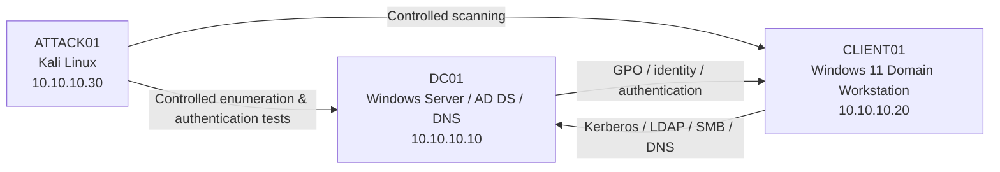

# Active Directory Attack & Defense Lab

Built an isolated Active Directory attack-and-defense lab using Windows Server, Windows 11, Kali Linux, VMware, Sysmon, Windows Security auditing, PowerShell logging, Nmap, NetExec, Impacket, and BloodHound tooling.

The lab was designed around a full defensive workflow:

**build → enumerate → simulate attacks → investigate telemetry → harden → retest**

> **Scope:** All activity in this repository was performed against systems I built and controlled in an isolated home lab. The accounts, passwords, IP addresses, and attack traffic shown here are lab-only and do not represent a production environment.

## What I Built

- Windows Server domain controller: `DC01`
- Active Directory forest/domain: `adlab.test`
- Windows 11 domain workstation: `CLIENT01`
- Kali Linux attacker VM: `ATTACK01`
- VMware host-only network: `10.10.10.0/24`
- Organized OUs for employees, administrators, servers, service accounts, and workstations
- Test users, groups, administrator accounts, and a service account with an SPN
- Windows Security auditing
- PowerShell Operational / Script Block logging
- Sysmon process, network, process-access, and DNS telemetry
- Account lockout hardening and credential remediation

## Architecture



The three systems were placed on an isolated VMware host-only network. DHCP was disabled for the lab segment and the systems used static addressing.


## Lab Results

| Scenario | Result | Evidence |
|---|---|---|
| Domain build and AD structure | Successful | `02.png` - `06.png` |
| Domain user logon / Kerberos ticketing | Successful | `07.png` |
| PowerShell and Sysmon telemetry | Successful | `08.png` - `11.png` |
| DNS and service discovery | Successful | `12.png`, `17.png` |
| LDAP base-domain discovery | Successful | `13.png` |
| Anonymous SMB enumeration | Limited / unsuccessful | `13.png` |
| Authenticated SMB / share discovery | Successful | `14.png`, `15.png`, `21.png` |
| Domain user/group enumeration | Successful | `15.png`, `16.png` |
| SYSVOL / GPO retrieval | Successful | `22.png` |
| BloodHound / SharpHound workflow | Partial; ingestion/stability issue | `bloodhoundlogin.png`, `failure.png` |
| Kerberoasting | Attempted; encryption-type mismatch | `24.png`, `KDC_ERR_ETYPE_NOSUPP.png` |
| AS-REP roasting | Attempted; no eligible account | `25.png` |
| Shared-password / password-spray simulation | Successful | `18.png`, `20.png` |
| Defender-side failed-logon correlation | Successful | `26.png` |
| Defender-side successful-logon correlation | Successful | `19.png`, `27.png` |
| DC credential validation correlation | Successful | `28.png` |
| Account-lockout hardening | Successful | `29.png` - `31.png` |
| Credential remediation validation | Successful | `32.png`, `33.png` |
| Post-hardening failed-logon evidence | Successful | `34.png` |

## Attack and Defense Story

### 1. Establish the domain

`DC01` was configured as the domain controller for `adlab.test`. Active Directory objects were organized into OUs for normal users, department groups, privileged accounts, service accounts, workstations, and servers.


A domain user was then used on the Windows workstation to validate normal Kerberos authentication. `whoami` confirmed the domain identity and `klist` showed Kerberos tickets issued by `DC01`.


### 2. Configure defender visibility

The Windows systems were configured to provide several telemetry sources useful during an investigation:

- Windows Security auditing
- Event `4688` process creation
- PowerShell Operational logging
- PowerShell Script Block Logging (`4104`)
- Sysmon Event `1` - Process Create
- Sysmon Event `3` - Network Connection
- Sysmon Event `10` - Process Access
- Sysmon Event `22` - DNS Query

Examples of the collected telemetry are preserved in `08.png` through `11.png`.

### 3. Enumerate from ATTACK01

The attacker VM first validated DNS and network reachability. Nmap identified the expected Active Directory services on `DC01`, including DNS, Kerberos, RPC, LDAP, SMB, and Global Catalog LDAP.


LDAP base queries exposed the domain naming context and hostname. Anonymous SMB enumeration was limited, which became an early troubleshooting point. After authenticating with a normal lab account, SMB and LDAP enumeration succeeded.

Authenticated enumeration identified:

- domain users
- domain groups
- Domain Admin membership
- readable `NETLOGON` and `SYSVOL`
- domain Group Policy files


The lab account could also retrieve policy files from `SYSVOL`, demonstrating why normal domain users can gather useful configuration information without administrative privileges.


### 4. Validate the primary weakness

The main successful attack simulation demonstrated the risk of password reuse across multiple domain users.

A controlled authentication test from `ATTACK01` used one known lab password against a small list of test accounts. Multiple accounts authenticated successfully from the same attacker host within the same short time window.


This provided a realistic event pattern to investigate from the domain controller.

### 5. Investigate from the defender side

The investigation correlated authentication telemetry on `DC01`.

Failed Windows logons from the attacker IP were visible in Event `4625`.


Successful Event `4624` network logons showed multiple usernames authenticating from `10.10.10.30` using Logon Type `3`.


The domain controller also recorded Event `4776` credential-validation activity for the same accounts.


The useful analyst pattern was not one individual event. It was the **correlation**:

- one source system
- several user accounts
- authentication events close together in time
- a mix of failures and successes

That pattern is much more meaningful than viewing each event in isolation.

## Hardening

The successful test showed that several lab users shared the same password, so remediation focused directly on the demonstrated weakness.

Actions taken:

1. Replaced the shared passwords with unique passwords.
2. Configured a domain account lockout threshold.
3. Set a 15-minute lockout duration.
4. Set a 15-minute lockout observation/reset window.
5. Verified the effective domain policy instead of assuming the GPO configuration had applied.

The final effective domain settings were:

```text
LockoutThreshold          5
LockoutDuration           00:15:00
LockoutObservationWindow  00:15:00
```


## Retest

The original shared password was tested again after remediation.

A single-account validation showed:

- old password: rejected
- new unique password: accepted


The original shared password was then tested once against all five remediated accounts. Every authentication attempt failed.


The defender-side logs confirmed Event `4625` failures from `10.10.10.30` for the remediated accounts.


This completed the lab's main lifecycle:

```text
Weakness identified
        ↓
Controlled attack succeeds
        ↓
Authentication telemetry investigated
        ↓
Weakness remediated
        ↓
Same attack is repeated
        ↓
Authentication fails
        ↓
Failure is confirmed in defender logs
```

## Important Troubleshooting and Partial Results

Not every planned technique succeeded, and those failures were intentionally kept in the documentation.

### BloodHound

BloodHound Community Edition was installed and the login interface became available, but the collection/ingestion workflow was not stable enough to use as the main source of attack-path analysis. Imported JSON data showed failures, and during troubleshooting the BloodHound service was also killed by the Linux OOM killer after graph-analysis activity.

The lab therefore continued with direct LDAP/SMB enumeration rather than allowing BloodHound to block the rest of the project.

**Future fix:** allocate additional RAM/swap to the BloodHound host, verify service health before import, perform a fresh SharpHound collection, import a smaller/clean dataset, and confirm graph objects before continuing.

### Kerberoasting

A service account named `svc_sql` was configured with an MSSQL SPN. The SPN and encryption settings were checked on the domain controller, but Impacket ticket requests returned `KDC_ERR_ETYPE_NOSUPP`.

The Kerberoasting path was treated as an unsuccessful experiment rather than forcing the environment into additional unverified changes.

**Future fix:** rebuild the intentionally vulnerable service-account scenario with known-compatible Kerberos encryption settings, verify time synchronization and SPN ownership, request a supported ticket type, then capture the corresponding DC Kerberos telemetry.

### AS-REP Roasting

`GetNPUsers` was tested, but no eligible accounts were returned. This was expected once it was confirmed that no test account had Kerberos preauthentication disabled.

**Future fix:** create one clearly labeled disposable lab account with preauthentication disabled, validate AS-REP roasting against only that account, capture the resulting telemetry, and then restore the secure setting.

### Default Domain Policy / SYSVOL permission mismatch

The Default Domain Policy could not be edited normally because Group Policy Management reported inconsistent permissions between the GPO and the SYSVOL folder.

A separate domain-linked GPO was created for the lockout settings, but validation showed the effective lockout threshold was still `0`. The domain password policy was then set directly and rechecked until the effective values returned `5 / 15 min / 15 min`.

**Future fix:** repair the Default Domain Policy ACL/SYSVOL permission inconsistency in a dedicated maintenance exercise, then move the settings back into normal GPO management.

### SMB timeout during retest

NetExec produced intermittent NetBIOS/SMB timeouts during one post-hardening check. LDAP was used instead to perform a deterministic credential validation. This separated a connectivity/protocol issue from the actual question being tested: whether the credentials still worked.

## Skills Demonstrated

Active Directory, Windows Server, DNS, Group Policy, Kerberos, LDAP, SMB, Sysmon, Windows Event Viewer, PowerShell logging, authentication-event analysis, Nmap, NetExec, Impacket, BloodHound troubleshooting, password-spray detection, account hardening, attack/defense validation, VMware networking, and technical documentation.

## Documentation

- [Architecture](docs/architecture.md)
- [Build Notes](docs/build-notes.md)
- [Telemetry](docs/telemetry.md)
- [Enumeration and Attack Validation](docs/attack-validation.md)
- [Investigation](docs/investigations.md)
- [Hardening and Retest](docs/validation.md)
- [Troubleshooting and Lessons Learned](docs/troubleshooting.md)
- [Security Decisions](docs/security-decisions.md)
- [MITRE ATT&CK Mapping](docs/mitre-mappings.md)
- [Future Work](docs/future-work.md)
- [Screenshot Index](docs/screenshot-index.md)

## Safety and Authorization

All attack activity was limited to an isolated VMware lab owned and controlled by the author. The repository documents controlled security testing for defensive learning. No production systems or third-party networks were targeted.

The visible passwords in a small number of screenshots were disposable lab-only credentials created for this environment. They should never be reused outside the lab.
