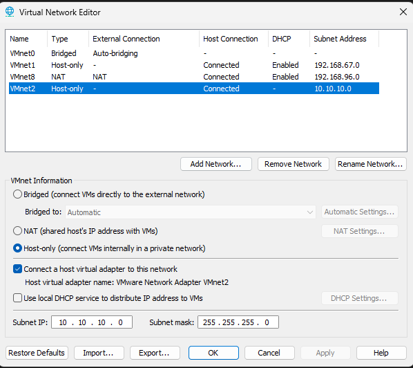
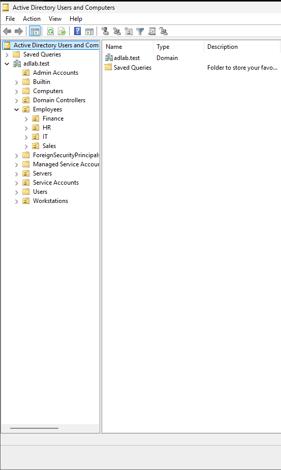
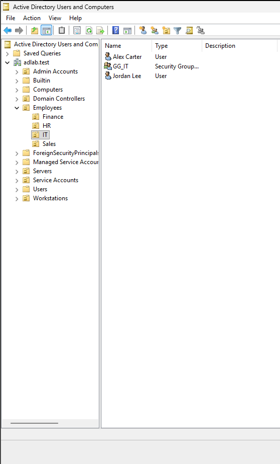
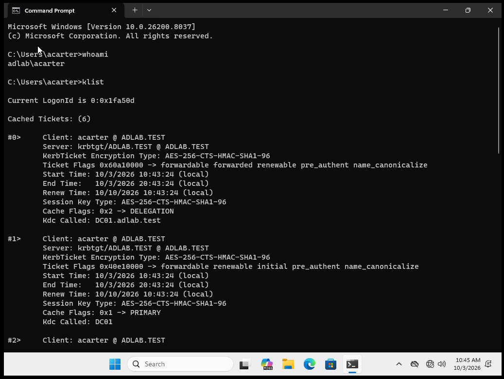

# Architecture

## Network

The lab uses VMware host-only network `VMnet2`.

- Subnet: `10.10.10.0/24`
- DHCP: disabled
- Purpose: keep attack traffic isolated from production/home devices

## Systems

| Host | Role | Address |
|---|---|---|
| `DC01` | Windows Server domain controller, AD DS, DNS, Group Policy | `10.10.10.10` |
| `CLIENT01` | Windows 11 domain workstation | `10.10.10.20` |
| `ATTACK01` | Kali Linux controlled attacker | `10.10.10.30` |

## Identity design

The domain is `adlab.test`.

The directory was organized into OUs for:

- Admin Accounts
- Employees
  - Finance
  - HR
  - IT
  - Sales
- Servers
- Service Accounts
- Workstations

Department security groups and test users were created so that enumeration produced a realistic small-business-style directory instead of a single flat list.

## Authentication path

`CLIENT01` was joined to `adlab.test`. A normal domain user login was validated with `whoami`, and `klist` showed Kerberos tickets issued by `DC01`.

