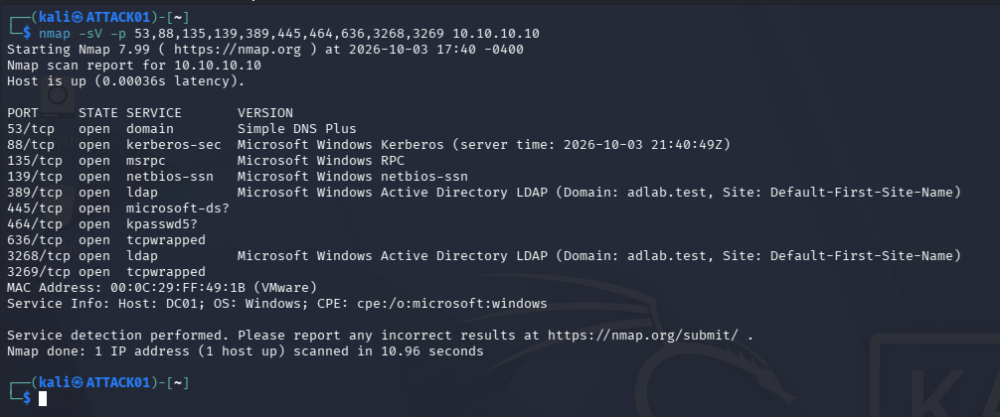
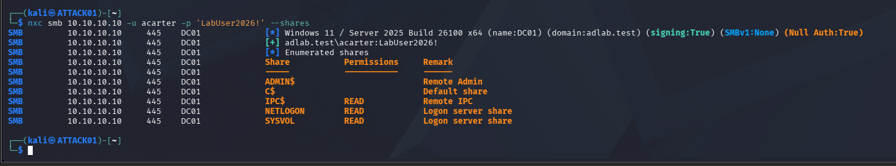
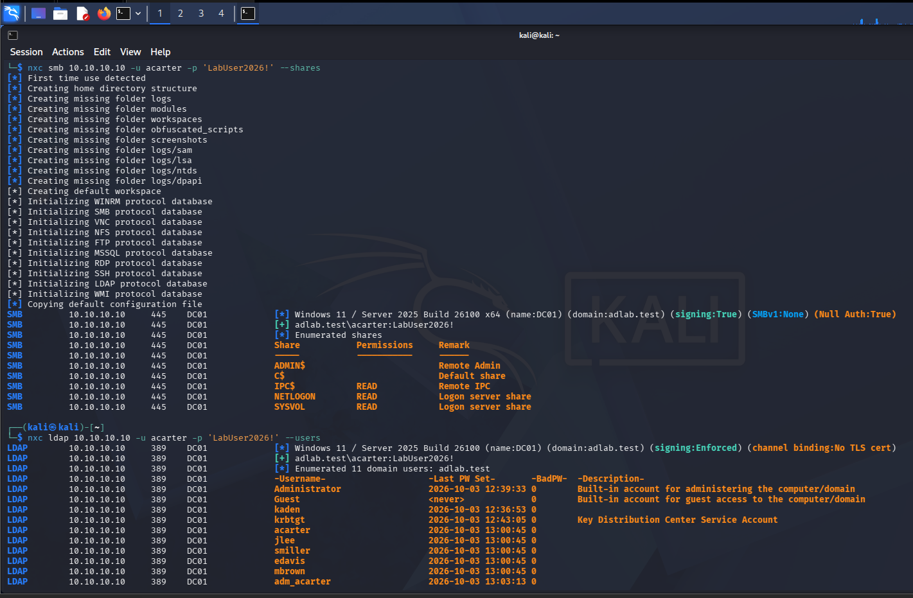
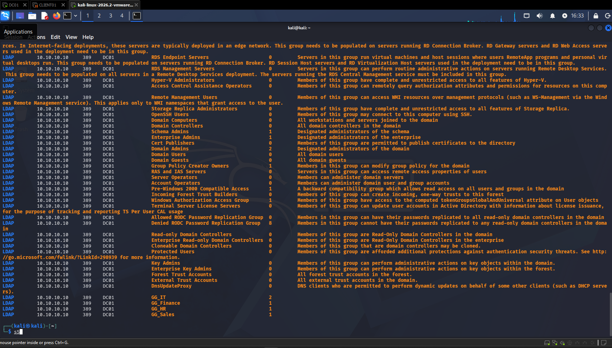
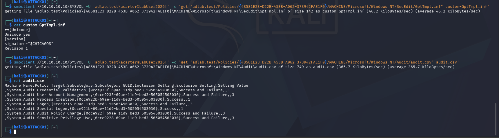
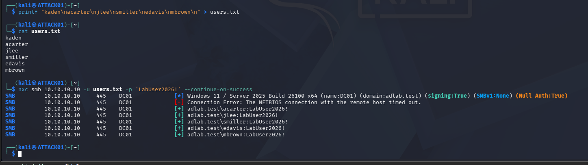
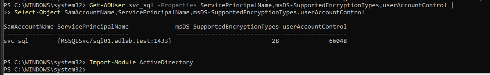
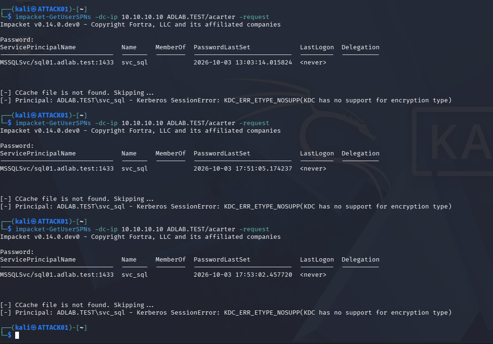
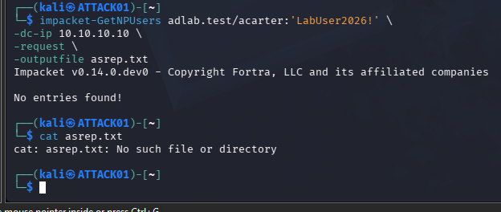

# Enumeration and Attack Validation

## Discovery

The first attacker-side step was validating DNS and host reachability.

Nmap on `DC01` identified normal Active Directory services:

- `53/tcp` DNS
- `88/tcp` Kerberos
- `135/tcp` RPC
- `139/tcp` NetBIOS
- `389/tcp` LDAP
- `445/tcp` SMB
- `464/tcp` Kerberos password services
- `3268/tcp` Global Catalog LDAP



## LDAP discovery

An anonymous base LDAP query returned:

- `dnsHostName: DC01.adlab.test`
- `rootDomainNamingContext: DC=adlab,DC=test`
- `defaultNamingContext: DC=adlab,DC=test`

This demonstrated that even a limited unauthenticated query could disclose useful domain metadata.

## SMB and LDAP authentication

Anonymous SMB enumeration did not provide useful access. Authenticated access with a normal domain account did.

Authenticated SMB enumeration exposed normal domain shares including:

- `NETLOGON`
- `SYSVOL`



Authenticated LDAP enumeration returned domain users and groups.





## SYSVOL inspection

The normal lab account could retrieve Group Policy files from `SYSVOL`.

Files examined included:

- `GptTmpl.inf`
- `audit.csv`



This reinforced an important Active Directory concept: readable domain policy data can provide valuable environmental context even without administrative privileges.

## Password-reuse simulation

The primary successful attack scenario used a controlled list of test users and one lab password.

Several users authenticated successfully from `ATTACK01`.



This created a strong scenario for defender-side investigation because the same source host generated authentication activity against several identities in a short time window.

## Kerberoasting attempt

The lab contained a service account named `svc_sql` with an MSSQL service principal name.

The SPN and encryption configuration were verified on the domain controller.



Ticket requests failed with:

```text
KDC_ERR_ETYPE_NOSUPP
```



The failure is intentionally documented rather than represented as a successful Kerberoast.

## AS-REP roasting attempt

Impacket `GetNPUsers` returned:

```text
No entries found!
```



No lab account was eligible for AS-REP roasting at that stage because the required preauthentication weakness was not present.
