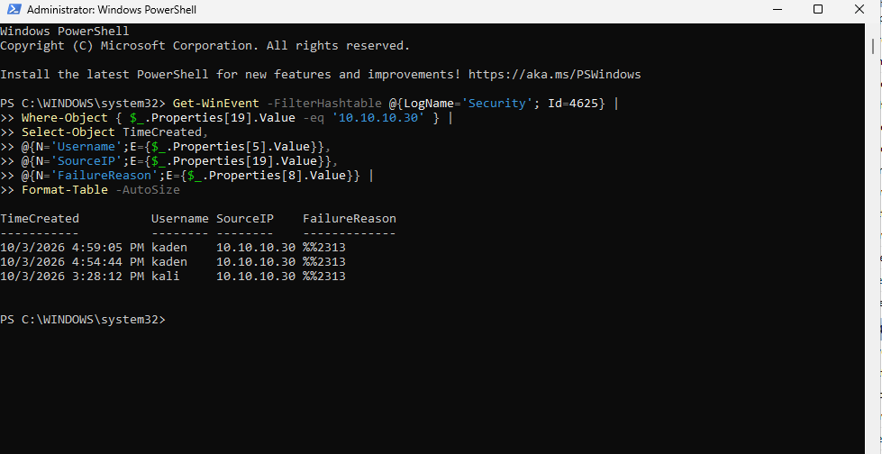
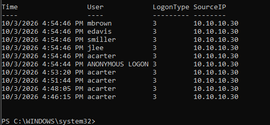
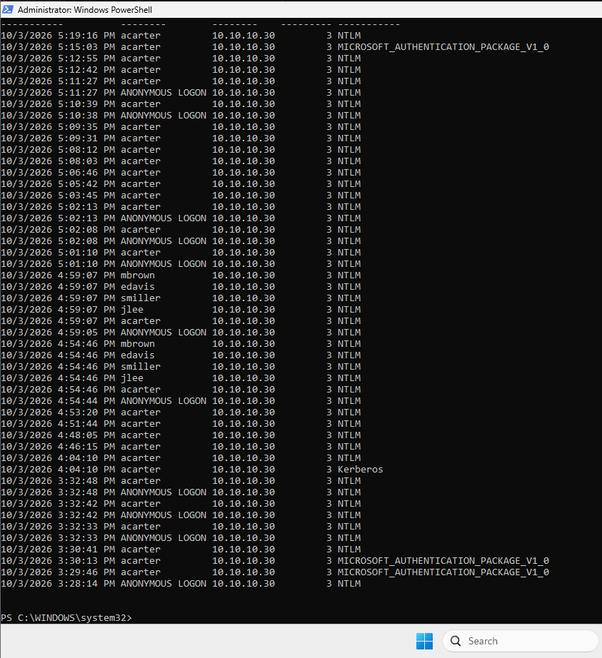
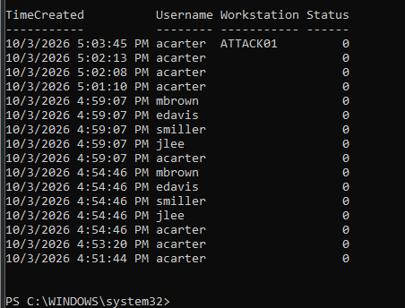

# Investigation

The strongest part of the lab was correlating the successful attacker-side authentication test with domain-controller telemetry.

## Failed logons - Event 4625

The domain controller recorded failed authentication attempts from:

```text
10.10.10.30
```

which was `ATTACK01`.



This established that the attacker-side activity was visible from the defender perspective.

## Successful logons - Event 4624

Successful Event `4624` entries were then filtered for the same source IP.

Multiple accounts appeared within seconds of one another with:

```text
SourceIP: 10.10.10.30
LogonType: 3
Authentication: NTLM
```



A broader output showed repeated successful logons for the same source host.



## Credential validation - Event 4776

Event `4776` provided domain-controller credential-validation evidence.

Several lab users appeared at nearly identical timestamps, and successful validation returned status `0`.



## Analyst conclusion

The suspicious behavior was not just "a successful login."

The stronger signal was:

1. one source host (`ATTACK01`)
2. several different user identities
3. attempts occurring in a very short period
4. a mixture of failed and successful authentications
5. repeated use of the same authentication path

That pattern is consistent with controlled password-spray / password-reuse testing and would deserve investigation in a production SOC.

## Investigation takeaway

This phase reinforced why analysts correlate **identity + source + time + outcome** instead of treating Windows authentication events as isolated records.
