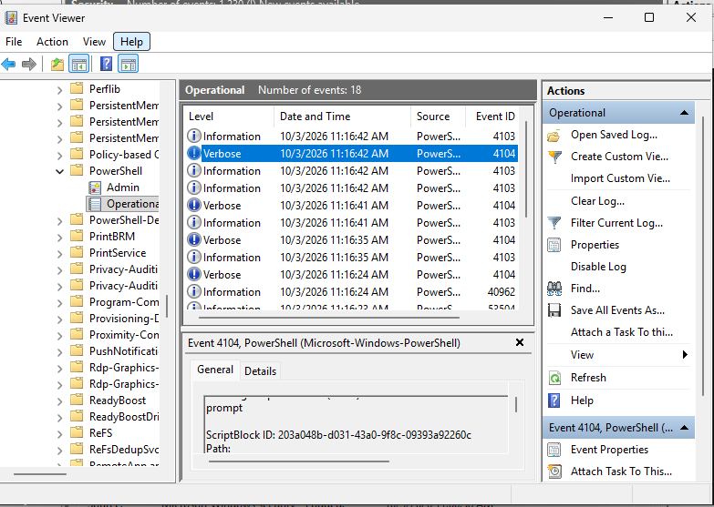
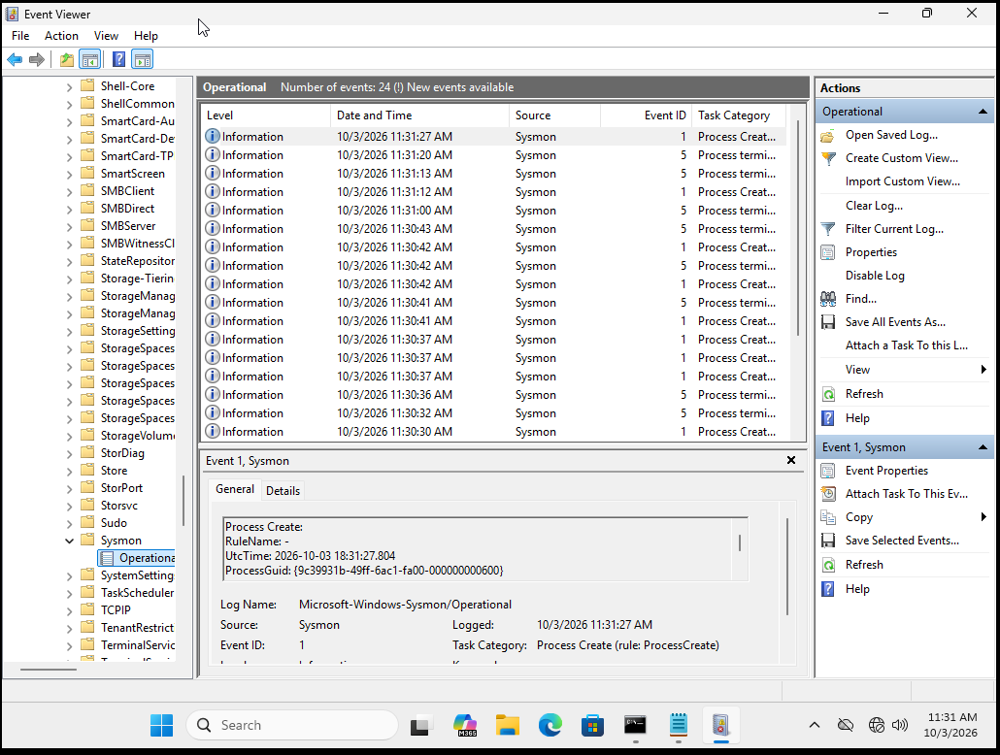
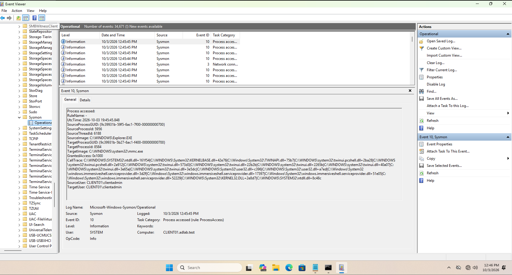
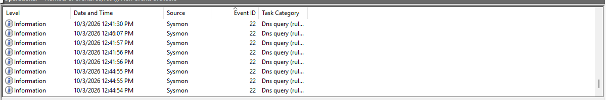

# Telemetry

The defensive half of the lab was configured before the main attack simulation so that activity could be investigated afterward.

## Windows Security

Security auditing was enabled to provide authentication and process visibility.

Important events used in the lab:

| Event | Purpose |
|---|---|
| `4624` | Successful logon |
| `4625` | Failed logon |
| `4688` | Process creation |
| `4776` | Domain credential validation |

## PowerShell Logging

PowerShell Operational logging and Script Block Logging were enabled.

Evidence in the screenshot set shows PowerShell Event `4104` data being recorded.

## Sysmon

Sysmon was installed to provide higher-fidelity endpoint telemetry.

The lab validated visibility for:

- Event `1` - Process Create
- Event `3` - Network Connection
- Event `10` - Process Access
- Event `22` - DNS Query

## Why this mattered

The goal was not simply to execute attack commands. The environment needed enough telemetry to answer:

- Which account authenticated?
- Was the authentication successful?
- Where did it come from?
- Was the activity isolated or repeated across users?
- Could the attack be correlated across multiple Windows events?
