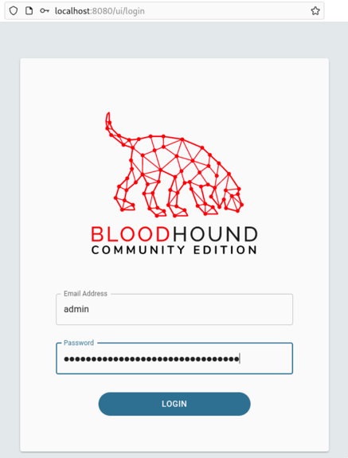

# Troubleshooting and Lessons Learned

## 1. Anonymous SMB enumeration

### What happened

An anonymous `smbclient` attempt did not provide useful share enumeration and returned a workgroup/SMB connection error.

### What worked instead

Authenticated SMB access with a normal domain account successfully listed domain shares.

### Lesson

Differentiate an authentication/authorization limitation from basic network reachability. The server was reachable; anonymous access simply was not the useful path.

---

## 2. LDAP signing / integrity requirement

### What happened

A simple authenticated `ldapsearch` bind returned an error stating that the server required signing/integrity when TLS was not active.

### What worked instead

Other authenticated enumeration paths were used, including NetExec and SMB.

### Lesson

Security controls on LDAP can change which tooling and bind methods work even when the credentials themselves are valid.

---

## 3. BloodHound ingestion and memory failure

### What worked

BloodHound Community Edition became reachable and the login interface loaded.



### What failed

The collected JSON data showed ingestion failures.


During troubleshooting, BloodHound analysis logs showed processing activity, but the service was later terminated by the Linux OOM killer at roughly 1 GB of memory usage.

### Decision

BloodHound was removed as a blocker. Direct LDAP, SMB, group, account, and SYSVOL enumeration already provided enough information to continue the attack-and-defense workflow.

### Future fix

- allocate more RAM to the BloodHound VM
- add/verify swap
- restart from a healthy BloodHound service state
- run a fresh SharpHound collection
- import a smaller clean dataset first
- verify nodes and edges before importing the full collection

### Lesson

A tool should support the lab objective, not become the objective. When one analysis platform failed, the project continued using the underlying protocols and evidence.

---

## 4. Kerberoasting encryption-type mismatch

### What happened

The `svc_sql` service account had an MSSQL SPN, but Impacket ticket requests returned:

```text
KDC_ERR_ETYPE_NOSUPP
```

The SPN and account encryption settings were checked on `DC01`.

### Decision

The attack was documented as unsuccessful instead of repeatedly changing Kerberos settings without a clear validation plan.

### Future fix

- rebuild one disposable service account specifically for the Kerberoasting scenario
- verify SPN ownership
- verify supported Kerberos encryption types
- confirm time synchronization
- request a ticket type supported by the test account/domain
- capture the resulting DC Kerberos events
- restore the account after the test

### Lesson

Finding an SPN does not guarantee that a specific Kerberoasting tool/request will succeed. Kerberos encryption compatibility matters.

---

## 5. AS-REP roasting returned no targets

### What happened

`GetNPUsers` returned:

```text
No entries found!
```

### Cause

No test user was configured with "Do not require Kerberos preauthentication."

### Future fix

Create one clearly labeled disposable vulnerable account, validate the technique, capture the defensive telemetry, and then restore preauthentication.

### Lesson

A failed AS-REP attempt can simply mean the vulnerability condition does not exist.

---

## 6. Default Domain Policy permission mismatch

### What happened

Group Policy Management reported that permissions for the Default Domain Policy were inconsistent between Active Directory and SYSVOL. `Edit` was unavailable.

### Workaround

A separate domain-linked GPO was created for the account lockout configuration.

### Validation problem

`Get-ADDefaultDomainPasswordPolicy` initially returned:

```text
LockoutThreshold 0
```

so the desired lockout behavior was not actually effective.

### Resolution

The effective domain password policy was explicitly set and validated until it returned:

```text
LockoutThreshold          5
LockoutDuration           00:15:00
LockoutObservationWindow  00:15:00
```

### Future fix

Repair the ACL/SYSVOL mismatch on the Default Domain Policy and return the domain to normal GPO-based administration.

### Lesson

Never treat a configuration screenshot as proof that a control is active. Validate the effective state.

---

## 7. SMB timeout during remediation retest

### What happened

A post-remediation NetExec SMB test returned intermittent NetBIOS connection timeouts, so the result did not prove whether the credentials were valid.

### Resolution

LDAP authentication was used to test the same credentials.

It cleanly showed:

- old password rejected
- new password accepted

### Lesson

When the question is credential validity, use a second reliable protocol to separate an authentication result from a transport/tooling failure.
