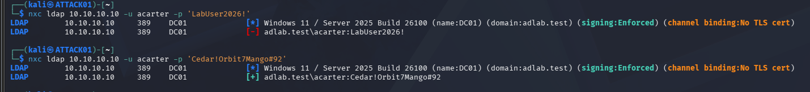
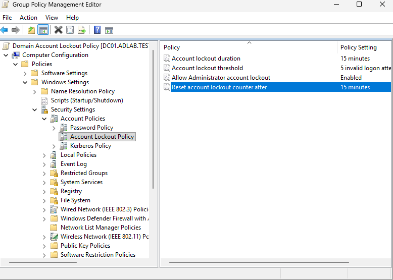
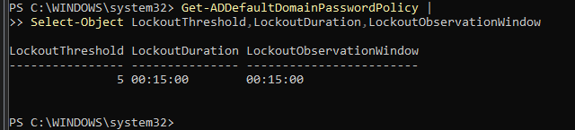
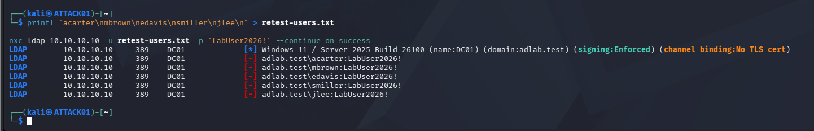
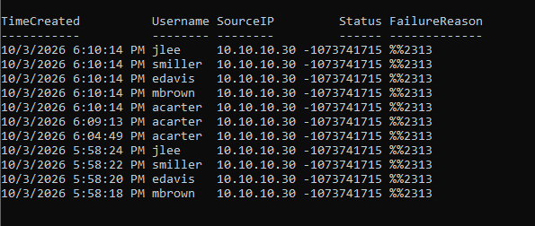

# Hardening and Retest

## Remediation goal

The attack simulation proved that multiple lab users could authenticate with the same password.

The remediation therefore addressed the demonstrated weakness directly.

## Credential remediation

The shared password was replaced with a unique password for each affected test account.

A one-account verification showed that:

- the old password failed
- the new password succeeded



## Account lockout policy

A domain account lockout policy was created with:

- threshold: `5` invalid attempts
- lockout duration: `15 minutes`
- reset/observation window: `15 minutes`



During validation, the effective domain threshold initially remained `0`, proving that simply configuring a GPO was not enough.

The domain policy was corrected and rechecked until the effective values were:

```text
LockoutThreshold          5
LockoutDuration           00:15:00
LockoutObservationWindow  00:15:00
```



## Retest

The exact old shared password was tested again against the same five accounts.

All five failed.



## Defender-side confirmation

The final check returned Event `4625` failures for the remediated accounts from `10.10.10.30`.



## Final result

| Stage | Result |
|---|---|
| Original shared-password test | Multiple accounts authenticated |
| Remediation | Unique passwords + lockout policy |
| Old-password retest | All targeted accounts rejected |
| Defender validation | Failed logons recorded from ATTACK01 |

The lab therefore demonstrated the full cycle of **attack → detection → investigation → remediation → retest**.
